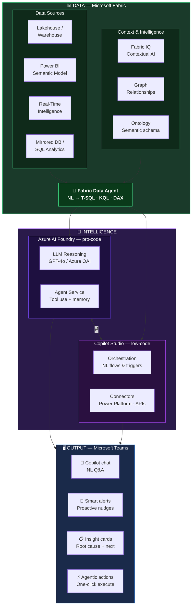

Traditional BI is a passive model: a user asks a question, an analyst or a report answers it. **Agentic BI** flips that logic — the agent queries data, reasons over context, and delivers actionable insights where decisions are made, with no human in the loop.

This article walks through the Agentic BI architecture on the Microsoft stack, its key components, and the business value it unlocks.

---

## Architecture overview

The architecture is organized into three vertical layers: **Data**, **Intelligence**, and **Output**.

---

## DATA layer — Microsoft Fabric

Microsoft Fabric is the foundation of the architecture. It centralizes all data assets in a single governed platform.

| Component | Role |
|---|---|
| **OneLake** | Unified storage — one copy of the data across the entire platform |
| **Lakehouse / Warehouse** | Structured Delta tables, SQL endpoints — the agent's primary query target |
| **Power BI Semantic Model** | Certified business metrics, pre-built KPIs and hierarchies |
| **Real-Time Intelligence** | Streaming data via Eventhouse / KQL DB for live anomaly detection |
| **Copilot in Fabric** | Native AI assistance built into the Fabric experience |

### The Fabric Data Agent

At the core of the system sits the **Fabric Data Agent** — a natural language query engine that can:

- Interpret NL questions and translate them into T-SQL, KQL, or DAX
- Reason across multiple data sources in a single query
- Use an **Ontology** layer to resolve semantic ambiguities (e.g. "Region" contains "Store" owns "Sales")
- Leverage **Microsoft Graph** to contextualise data with organisational relationships (users, teams, documents)
- Be enriched by **Fabric IQ**, the native AI layer that surfaces proactive insights and usage recommendations

---

## INTELLIGENCE layer — Pro-code vs Low-code

This is where the agent's reasoning is built. Two approaches coexist and complement each other.

### Azure AI Foundry (pro-code)

The reference runtime for building custom agents using the Fabric SDK, Python, and Azure OpenAI — full control over reasoning and tool use.

- **LLM reasoning**: GPT-4o / Azure OpenAI
- **Agent service**: tool use management and context memory

**When to use it**: complex business logic, multi-step agents, external system integrations, fine-grained control over prompts and model behaviour.

### Copilot Studio (low-code)

A low-code builder to expose the Fabric Data Agent as a conversational bot and orchestrate automated workflows via Power Automate.

- **Orchestration**: NL flows and automated triggers
- **Connectors**: Power Platform, third-party APIs

**When to use it**: fast exposure to business users, workflow automation, scenarios without complex reasoning logic.

> The two approaches are not mutually exclusive — an agent built with AI Foundry can be surfaced through Copilot Studio.

---

## OUTPUT layer — Microsoft Teams

The agent delivers its outputs directly in Teams — where users already work, with no new tool to learn.

| Capability | Description |
|---|---|
| **Copilot chat** | Natural language Q&A over Fabric data |
| **Smart alerts** | Proactive notifications triggered by thresholds or detected anomalies |
| **Insight cards** | Contextual cards with root cause analysis and next-best-action recommendation |
| **Agentic actions** | One-click action execution directly from the insight card |
| **M365 publish** | Direct deployment across the Microsoft 365 ecosystem |

---

## Why Agentic BI?

### 1. Faster insights
From question to root cause in seconds — no waiting for an analyst or an ad hoc report.

### 2. Business user autonomy
Non-technical users get answers in natural language, directly in their daily work environment.

### 3. From insight to action
Recommendations surface where decisions are made. The action can be triggered in one click from the Teams notification.

### 4. Built on existing data
The architecture leverages the Lakehouse, Semantic Model, and Power BI reports already in place — no need to start from scratch.

---

## What this actually changes

The shift is fundamental: from **pull** BI (the user goes looking for information) to **push + act** BI (the agent detects, notifies, and proposes the next step). Data no longer sits in a dashboard — it reaches the right person at the right moment, with context and next action already formulated.

The Microsoft stack — Fabric, AI Foundry, Copilot Studio, and Teams — provides the building blocks to close this loop end to end, with a level of governance and security that meets enterprise requirements.
