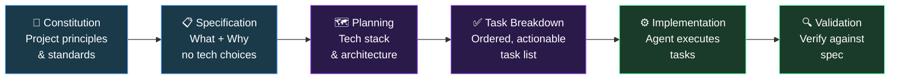

AI coding agents are changing the speed at which we ship — but speed without structure is just faster chaos. The pattern I see repeatedly: an agent generates code that works for the happy path, drifts from the original intent after a few iterations, and leaves the team with a codebase nobody fully understands.

**Spec-Driven Development (SDD)** is a response to that problem. Instead of describing what you want in a chat and hoping the agent figures it out, you author structured specifications that become executable artifacts — directly driving implementation across agents, tasks, and validation steps.

[spec-kit](https://github.com/github/spec-kit) is GitHub's open-source toolkit for doing this in practice. Here's how it works and why it matters.

---

## The core idea: specs first, code second

In traditional development, specifications are scaffolding — they exist to guide engineers, then get ignored as the code evolves. SDD flips this:

> Specifications become executable, directly generating working implementations rather than just guiding them.

The agent doesn't interpret your intent — it executes against a structured artifact that captures *what* you want and *why*, leaving the *how* to the planning phase. This separation is the key to predictable outcomes.

---

## The six-phase workflow

spec-kit structures development into six sequential phases, each producing an artifact consumed by the next.



| Phase | Command | Output |
|---|---|---|
| **Constitution** | `/speckit.constitution` | Project governing principles, quality standards, development guidelines |
| **Specification** | `/speckit.specify` | Functional requirements and user stories — *what* and *why*, no technology |
| **Planning** | `/speckit.plan` | Technical implementation strategy with chosen stack |
| **Task Breakdown** | `/speckit.tasks` | Ordered, actionable task list generated from the plan |
| **Implementation** | `/speckit.implement` | Agent executes tasks against spec and plan |
| **Validation** | `/speckit.checklist` | Verify implementation against the original specification |

The separation between **specification** (no tech) and **planning** (tech choices) is intentional. It keeps product requirements stable while allowing the architecture to evolve independently.

---

## Project structure

spec-kit creates a `.specify/` directory at the root of your project:

```
.specify/
├── memory/          # Project constitution — persistent context for agents
├── specs/           # Feature specifications
├── scripts/         # Automation helpers
├── templates/       # Customisable artifact templates
├── extensions/      # Added capabilities and commands
└── presets/         # Workflow customisations
```

Specifications live as versioned files alongside your code. They are diff-able, reviewable in PRs, and serve as the source of truth when requirements drift.

---

## Optional quality gates

Two commands help catch issues before implementation starts:

- **`/speckit.clarify`** — structured questioning to resolve ambiguities in the spec before moving to planning. Forces explicit decisions rather than agent assumptions.
- **`/speckit.analyze`** — cross-artifact consistency check across constitution, spec, plan, and tasks. Surfaces conflicts early.

Making clarification a required step before planning is one of the highest-leverage practices in SDD: it eliminates the "I thought you meant X" failures that typically surface during code review.

---

## Extensions and presets

The framework is extensible in two dimensions:

**Extensions** add new commands and capabilities. The community maintains 100+ extensions across five categories:

| Category | Examples |
|---|---|
| **Integration** | Jira, Azure DevOps, Confluence, GitHub Issues |
| **Process** | V-Model test traceability, security auditing, post-implementation review |
| **Visibility** | Architecture diagrams, dependency graphs |
| **Docs** | Auto-generated ADRs, API documentation |
| **Code** | Linting presets, code style enforcement |

**Presets** customise existing workflows without adding commands — they override templates to enforce team standards, compliance requirements, or methodology patterns (e.g. always require a security section in specs, enforce a specific ADR format).

Resolution order: project-local overrides → installed presets → installed extensions → core defaults. Your team standards always win.

---

## AI agent integration

spec-kit works with 30+ AI coding agents including **Claude Code**, GitHub Copilot, Gemini CLI, and Cursor. Integration is through slash commands or agent skills, depending on the agent.

For Claude Code specifically:
```bash
# Install spec-kit
uv tool install specify-cli --from git+https://github.com/github/spec-kit.git@v<version>

# Then use slash commands directly in your Claude Code session
/speckit.constitution
/speckit.specify
```

The agent reads the `.specify/` artifacts as structured context — replacing ad hoc prompt engineering with a consistent, reproducible workflow.

---

## Greenfield vs Brownfield

spec-kit explicitly supports both scenarios:

**Greenfield (0-to-1)** — start with the constitution, write specs for each feature, plan, build. The spec becomes the product backlog.

**Brownfield** — add a spec retroactively for a new feature on an existing codebase. The constitution captures existing conventions; specs add the new capability without destabilising the rest.

**Creative exploration** — run the same spec through two different planning phases with different tech stacks. Compare implementations before committing to one direction.

---

## Why this matters for AI-assisted development

The promise of AI coding agents is 10x output. The reality, without structure, is 10x output with unpredictable quality and increasing entropy. Spec-Driven Development gives agents a contract to execute against — not a prompt to interpret.

Three things change when you adopt SDD:

1. **Requirements drift is visible** — when the spec changes, you see it in version control. When the implementation drifts from the spec, validation catches it.
2. **Agent output is auditable** — "does this code match the specification?" is a concrete question with a concrete answer.
3. **Onboarding accelerates** — new team members read the `.specify/` directory to understand *why* the system is built the way it is, not just *how*.

The shift is from *vibe coding* — iterative, intuition-driven, agent-as-oracle — to structured, specification-first development where agents are powerful executors of well-defined intent.

---

## Getting started

```bash
# Prerequisites: Python 3.11+, uv or pipx

# Install
uv tool install specify-cli --from git+https://github.com/github/spec-kit.git@v<version>

# In your project, start with the constitution
/speckit.constitution

# Write your first spec
/speckit.specify

# Plan, break down, implement, validate
/speckit.plan
/speckit.tasks
/speckit.implement
/speckit.checklist
```

The full documentation and community extensions are available at [github.com/github/spec-kit](https://github.com/github/spec-kit).
